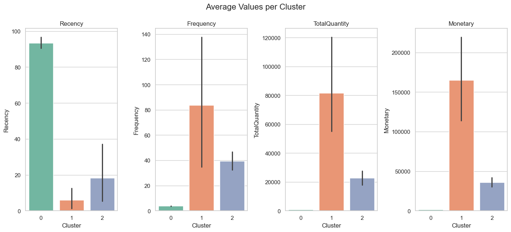

# 🧠 Customer Segmentation using K-Means & PCA

This project applies **K-Means Clustering** and **PCA (Principal Component Analysis)** on the **Online Retail Dataset** to segment customers based on their purchasing behavior.  
The goal is to group customers with similar behavior to enable **personalized marketing strategies** and **better business decisions**.

---

## 📌 Objectives

- Understand customer purchasing patterns.
- Group customers based on Recency, Frequency, Quantity, and Monetary value.
- Visualize customer segments using PCA.
- Provide actionable insights and marketing recommendations.

---

## 🛠️ Technologies Used

- Python
- Pandas
- NumPy
- Matplotlib / Seaborn
- Scikit-learn (PCA, KMeans, StandardScaler, Silhouette Score)

---

## 📈 Key Steps

1. **Data Cleaning**  
   - Removed missing `CustomerID` values  
   - Filtered out cancelled transactions (`Quantity < 0`)  
   - Created `TotalPrice` column  

2. **Feature Engineering**  
   - Calculated Recency, Frequency, TotalQuantity, and Monetary value per customer  

3. **Standardization**  
   - Applied `StandardScaler` to normalize features  

4. **Dimensionality Reduction**  
   - Used PCA to reduce dimensions to 2D for visualization  
   - Achieved **85% explained variance** with 2 components  

5. **K-Means Clustering**  
   - Optimal number of clusters determined using **Elbow Method** and **Silhouette Score = 0.82**  
   - 3 clusters identified  

6. **Cluster Profiling & Business Insights**  
   - Each cluster analyzed and interpreted to guide marketing strategies

---

## 📊 Final Visualization



---

## 💡 Insights

| Cluster | Description                        | Strategy                                   |
|---------|------------------------------------|--------------------------------------------|
| 0       | Inactive or lapsed customers       | Win-back offers / re-engagement campaigns  |
| 1       | Loyal, high-value customers (VIPs) | Personalized loyalty programs              |
| 2       | Moderate / potential customers     | Cross-sell, upsell, targeted promotions    |

---

## ▶️ How to Run

1. Clone the repo:
```bash
git clone https://github.com/your-username/customer-segmentation.git
cd customer-segmentation
